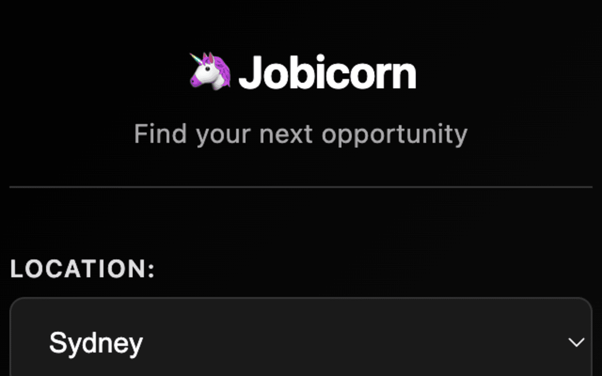

# 🦄 Jobicorn

**Open unicorn companies' career pages with filters**

A Chrome extension that streamlines your job search by allowing you to quickly open multiple career pages from top companies with your preferred location and job search filters.

## Features

- **Multi-company selection**: Choose from Macquarie Group, Westpac, Atlassian, and Canva
- **Smart filtering**: Add location preferences and job search keywords
- **Bulk operations**: Open multiple career pages simultaneously with one click
- **Persistent state**: Your selections and filters are saved between sessions
- **Clean interface**: Simple, intuitive sidebar design

## Companies Included

- **Macquarie Group** - Investment banking & financial services
- **Westpac** - Major Australian bank  
- **Atlassian** - Software development & collaboration
- **Canva** - Visual design & collaboration platform

## How to Use

1. Click the Jobicorn extension icon to open the sidebar
2. Select your preferred location (currently supports Sydney)
3. Enter job search keywords (e.g., "frontend", "backend", "data")
4. Check the companies you want to explore
5. Click "Open Career Pages" to launch filtered job searches in new tabs

## Installation

1. Download or clone this repository
2. Open Chrome and navigate to `chrome://extensions/`
3. Enable "Developer mode" in the top right
4. Click "Load unpacked" and select the extension folder
5. The Jobicorn icon will appear in your extensions toolbar

## Screenshots

## Technical Details

- **Manifest Version**: 3
- **Permissions**: tabs, sidePanel, storage
- **Architecture**: Background service worker with side panel UI

## License

Dual-licensed: **AGPL-3.0** (see [LICENSE](LICENSE)) and **Commercial** (see [COMMERCIAL.md](COMMERCIAL.md)).

## License

This project is **dual-licensed**:

- 🆓 **AGPL-3.0** — free for personal use, open-source forks, and projects themselves open-sourced under a compatible license. See [LICENSE](LICENSE).
- 💼 **Commercial license** — required for closed-source products, proprietary internal tools, or paid / hosted services where AGPL-3.0's copyleft and network-use obligations don't fit. See [COMMERCIAL.md](COMMERCIAL.md).

### Do I need a commercial license?

| Use case | License |
|---|---|
| Personal use / running locally | AGPL-3.0 (free) |
| Forking and publishing under AGPL-3.0 | AGPL-3.0 (free) |
| Bundling into a closed-source product | **Commercial** |
| Hosting a modified version as a SaaS without publishing source | **Commercial** |
| Internal company tool not open-sourced | **Commercial** |

For a commercial license, contact **Robert Wang** at **xwang.robert@gmail.com** — see [COMMERCIAL.md](COMMERCIAL.md) for what to include in your request.
